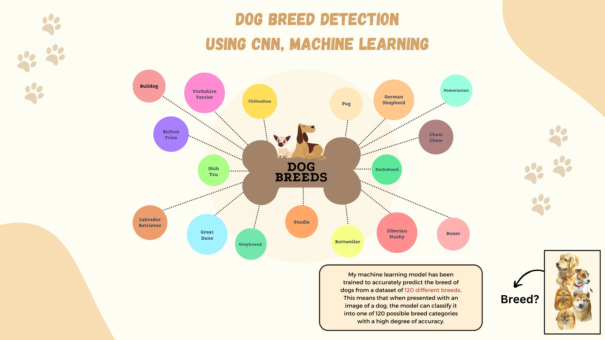
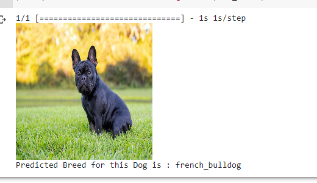
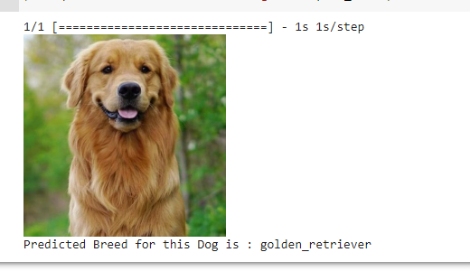
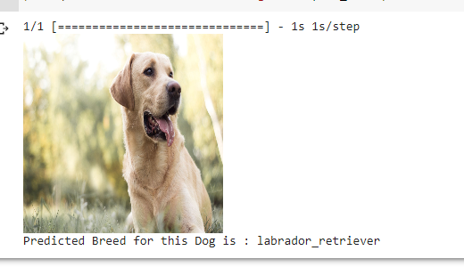

<p align="center">
  
</p>

<h1 align="center">Dog Breed Classifier</h1>

<p align="center">
  Fine-grained image classification with ResNet50V2 transfer learning.
</p>

<p align="center">
  
  
  
  
</p>

<p align="center">
  <a href="dog_breed_detection.ipynb"><strong>Explore the notebook</strong></a>
  ·
  <a href="https://drive.google.com/file/d/15msq1hzx9o_aOHkkNWm3q4kMbUuL3MFJ/view?usp=drive_link">Project report</a>
  ·
  <a href="https://drive.google.com/file/d/1Cc1dJSQUUp12INPewXd7C3lXG5Y-Fndt/view?usp=drive_link">Execution report</a>
</p>

## Overview

This notebook builds an end-to-end dog-breed classification pipeline on the Kaggle Dog Breed Identification dataset. It prepares image and label data, augments the training set, uses an ImageNet-pretrained ResNet50V2 backbone, trains a custom classification head, and runs inference on unseen dog images.

| Experiment | Configuration |
| --- | --- |
| Dataset | Kaggle Dog Breed Identification — 120 source labels |
| Training scope | 60 selected breed classes |
| Input | 224 × 224 RGB images |
| Model | Frozen ResNet50V2 backbone + batch normalization + dense head |
| Split | 80% training / 20% validation |
| Training | RMSprop, batch size 64, 20 epochs |
| Best recorded validation accuracy | **80.66%** |

## Prediction samples

<p align="center">
  
  
  
</p>

## Pipeline

```text
Kaggle images + labels
        ↓
Resize and ResNet preprocessing
        ↓
Train/validation split + augmentation
        ↓
ResNet50V2 feature extractor
        ↓
Classification head and training
        ↓
Breed prediction for a new image
```

## Run the notebook

1. Clone the repository and create a Python environment.
2. Install the dependencies:

   ```bash
   pip install -r requirements.txt
   ```

3. Configure the [Kaggle API](https://github.com/Kaggle/kaggle-api) locally. Never commit `kaggle.json`.
4. Open `dog_breed_detection.ipynb` in Jupyter or Google Colab and run the cells in order.

The trained model and downloaded dataset are intentionally excluded from version control because they are generated artifacts.

## Repository layout

```text
.
├── dog_breed_detection.ipynb    # data preparation, training and inference
├── test images/                  # small inputs used for inference checks
├── docs/assets/                  # README visuals and clean prediction crops
├── requirements.txt
└── README.md
```

---

<p align="center">
  Built by <a href="https://github.com/rahultripathi17">Rahul Tripathi</a>
  · <a href="https://rahul-tripathi.web.app">Portfolio</a>
  · <a href="https://www.linkedin.com/in/rahultripathi17/">LinkedIn</a>
</p>
